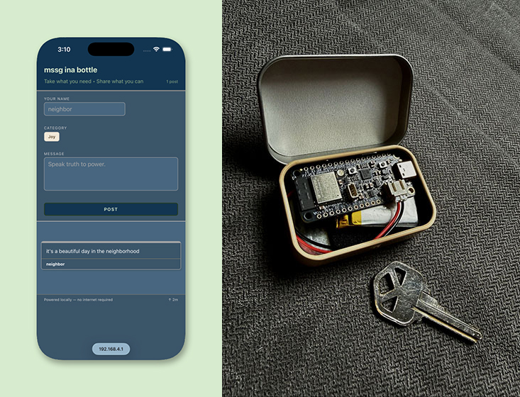
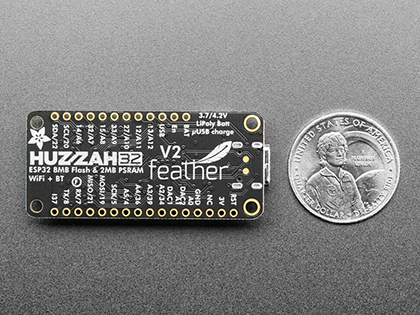
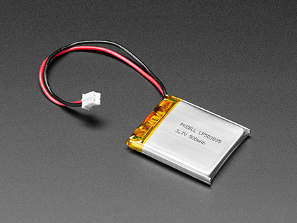

# mssg ina bttl

mssg ina bttl is a hyper-local, self-contained, internet-free neighborhood message board running on an ESP32. This specific version runs on an Adafruit HUZZAH32 v2, the ESP32-based Feather board. It creates its own local WiFi network, serves a responsive web interface, and persists all messages and settings to internal flash.

Pair the Feather with a LiPoly battery, drop them into a cute container and then your pocket, then go on with yo hyper-local self.




## Forked with thanks from SonicDH

Community Hub
- https://github.com/SonicDH/Community-Hub


With an excellent breakdown by the author, Victor Frost:
- https://www.heyvictorfrost.com/workshop/Community_hub_V1


## Features

- **Zero-Internet Operation** – Runs entirely on a local Access Point. No cloud, no external dependencies.
- **Message Board** – Auto-expiration & smart storage management.
- **Admin Panel** – Full configuration interface for board identity, time, LED behavior, backup/restore, and signed firmware updates.
- **Session-Based Auth** – Secure admin access using short-lived tokens (30-minute lifetime). Admin key is never transmitted to the browser.
- **Persistent Storage** – All settings and messages survive reboots via LittleFS.
- **Smart LED Indicator** – Day/night brightness, sine-wave pulsing, and faster pulsing on recent activity.
- **Captive Portal Support** – Auto-redirects iOS, Android, Windows, and Firefox connectivity probes to the main board.

---

## Hardware & Software Requirements

| Component | Requirement |
|-----------|-------------|
| **MCU** | ESP32 (Adafruit Feather V2) |
| **Storage** | Internal Flash (LittleFS) |
| **IDE** | VS Code with PlatformIO Extension |
| **Board Package** | `espressif32` via PlatformIO |
| **Partition Scheme** | `Default 4MB` |
| **Library** | `ArduinoJson` (v7+) |

---

## Hardware & Software Used

The setup used in this specific build:

- [Adafruit ESP32 Feather V2](https://learn.adafruit.com/adafruit-esp32-feather-v2/overview)
- [Lithium Ion Polymer Battery - 3.7v 500mAh](https://www.adafruit.com/product/1578)




---

## Installation & Setup

1. **Prerequisites**
   - Install **VS Code** and the **PlatformIO IDE** extension.
   - Ensure your ESP32 Feather V2 is connected via USB.

2. **Project Configuration**
   PlatformIO manages dependencies and board support via `platformio.ini`.
   Ensure your configuration file contains the following:

   ```ini
   [env:adafruit_feather_esp32_v2]
   platform = espressif32
   board = adafruit_feather_esp32_v2
   framework = arduino
   monitor_speed = 115200
   upload_speed = 115200
   board_build.filesystem = littlefs

   ; Dependencies
   lib_deps =
     bblanchon/ArduinoJson@^7.4.3
   ```

3. **Upload LittleFS Files**
   The backend expects frontend assets in LittleFS:
   - `/frontend.html`, `/styles.css`
   - `/admin.html`, `/admin.css`, `/admin.js`
   
   Place these files in the `data/` folder at the root of your project. Then run:
   ```bash
   pio run --target uploadfs
   ```
   *(Or click the "Upload Filesystem Image" button in the VS Code PlatformIO toolbar)*

4. **Build & Upload Sketch**
   Build and upload the firmware using:
   ```bash
   pio run --target upload
   ```
   *(Or click the "Upload" button in the VS Code PlatformIO toolbar)*

   Day-to-day firmware updates can also be done over-the-air; see the OTA Updates section below.

5. **Power On & Connect**
   The device will boot and create a WiFi network. Connect to it and open any browser to `http://10.0.0.10` (or just open a browser to trigger captive portal).
   Use `pio device monitor` to view serial output for debugging.

---

## Local Development

You can run the frontend and a mock API locally with Docker — no ESP32 required. This is useful for iterating on HTML, CSS, or JS without re-flashing the board.

A `docker-compose.yml` and mock API are included in the repo.

```bash
docker compose up --build
```

Then open:
- **Board:** `http://localhost:8888`
- **Admin panel:** `http://localhost:8888/admin`

The default admin key for the mock server is `lavish.meerkat`.

### What it runs

| Service | Purpose |
|---------|---------|
| `nginx` | Serves static files from `data/` (the same files uploaded to LittleFS) |
| `mock-api` | Express server that mimics the ESP32 backend endpoints |

### Mapped endpoints

The nginx container proxies API calls to the mock server, so the frontend works exactly as it does on the device:

| Endpoint | Mock behavior |
|----------|---------------|
| `GET /api/status` | Returns `{ "full": false }` |
| `GET /messages` | Returns seeded sample posts |
| `POST /post` | Adds a post to in-memory storage |
| `GET /info` | Returns board identity & uptime |
| `POST /admin/auth` | Issues a session token if key matches |
| `GET /admin/config` | Returns current identity settings |
| `GET /admin/led/get` | Returns LED configuration |
| `GET /admin/led/set` | Updates LED settings in memory |
| `GET /admin/clear` | Wipes all mock posts |
| `GET /admin/delete/post` | Removes a post by ID |
| `GET /admin/backup` | Downloads messages as JSON |
| `POST /admin/restore` | Restores messages from JSON |
| `POST /admin/ota` | Accepts any token-valid POST and returns success |

All mock data lives in memory — restart the container to reset to seed data.

### Changing the port

If `8888` is taken, edit the `ports` mapping in `docker-compose.yml`:

```yaml
ports:
  - "8888:80"
```

---

## OTA Updates

OTA is supported, but it requires **three things** to reduce the chance of a remote takeover:

1. **A physical button press** on the board to enable OTA mode for 5 minutes.
2. **A valid ECDSA P-256 signature** over the firmware binary.
3. A **version number higher** than the last accepted OTA version (anti-rollback).

> **⚠️ Important:** The `OTA_PUBLIC_KEY_PEM` in `src/main.cpp` is a compile-time placeholder. Generate your own keypair and replace it before deploying, or the device will not accept your signed firmware. The private key (`ota_private.pem`) should stay offline and **never** be committed.

> OTA signing prevents malicious firmware from being flashed, but it does **not** encrypt the upload. The `.bin` and `.manifest.json` still travel in plaintext over the open AP, so treat the private key like a secret.

### Button wiring

Connect a momentary button between the `OTA_BUTTON_PIN` (default **GPIO 15**) and **GND**. Press it once to enable OTA mode for 5 minutes. Change `Config::OTA_BUTTON_PIN` in `src/main.cpp` if you want a different pin.

### Generate a signing keypair

```bash
python scripts/ota-tool.py generate
```

This creates `ota_private.pem` and `ota_public.pem` and prints a C string. Paste that string into `src/main.cpp` as `OTA_PUBLIC_KEY_PEM`, then re-flash the board.

### Sign a firmware binary

```bash
pio run --target upload
python scripts/ota-tool.py sign .pio/build/adafruit_feather_esp32_v2/firmware.bin --version 2
```

This produces `firmware.bin.manifest.json`.

### Flash it

1. Press and hold the OTA enable button on the board (default GPIO 15 — change `Config::OTA_BUTTON_PIN` if needed).
2. In the admin panel, choose the `.bin` and `.manifest.json` files, then click **Upload & Reboot**.

---

## Configuration & Usage

### Default Network Settings
| Setting | Value |
|---------|-------|
| **SSID** | `mssg ina bttl` |
| **Password** | Open network (none) |
| **Channel** | 6 |
| **Max Clients** | 8 |

### Admin Access
1. Navigate to `http://<device-ip>/admin`
2. Enter the admin key. **Default:** `lavish.meerkat` *(change immediately via the admin panel or by editing `Config::ADMIN_KEY`)*
3. You'll receive a session token valid for 30 minutes.

### Setting the Time
The device tracks time internally but drifts without NTP. Set it manually via the admin panel using the format:
```
DDMMYYYY-HHMM
```
Example: `15042024-1430` → April 15, 2024 at 14:30

### LED Behavior (Pin 4 by default)

This 👇 is taken from the original repo. I haven't ported this to the Feather as of yet.

- **Day Mode:** Higher brightness, slow pulse
- **Night Mode:** Lower brightness, slow pulse
- **Activity Mode:** Faster pulse for 3 hours after any new post
- All thresholds, pin, and toggles are adjustable in the admin panel.

---

## API & Endpoints

### Public
| Method | Path | Description |
|--------|------|-------------|
| `GET` | `/` | Main board interface |
| `GET` | `/info` | Board identity & uptime (JSON) |
| `GET` | `/messages` | Active messages (JSON) |
| `POST` | `/post` | Submit new message (JSON body) |
| `GET` | `/api/status` | Board capacity status (`{ "full": true/false }`) |

### Admin (Requires valid session token)
| Method | Path | Description |
|--------|------|-------------|
| `POST` | `/admin/auth` | Authenticate & receive session token |
| `GET` | `/admin/identity/get` | Get board identity settings |
| `POST` | `/admin/identity/set` | Update board identity |
| `POST` | `/admin/time` | Set internal clock |
| `GET/POST` | `/admin/led/get` & `/admin/led/set` | LED configuration |
| `GET` | `/admin/backup` | Download messages JSON |
| `POST` | `/admin/restore` | Restore messages from JSON |
| `POST` | `/admin/setkey` | Change admin key |
| `POST` | `/admin/flush` | Force-save all pending data |
| `POST` | `/admin/ota` | Signed firmware update (requires button + signature) |
| `POST` | `/admin/clear` | Wipe all messages |
| `POST` | `/admin/delete/post` | Remove specific message by `id` |

---

## Security Notes

- **Local-Only Network:** The device never connects to the internet. All traffic stays within the AP.
- **Session Tokens:** Admin key is only used once to generate a 30-minute token. Subsequent requests use `?token=...`.
- **Input Sanitization:** All user text is stripped of `< >` characters and trimmed. Max lengths enforced.
- **Type Validation:** Only `Notice`, `Offer`, `Need`, `Event` are accepted. Others default to `Notice`.
- **Change Default Key:** The hardcoded fallback is `lavish.meerkat`. Update it via the admin panel or source code before deployment.
- **Signed OTA:** Firmware updates require an ECDSA signature, a higher version number, and a physical button press. Replace the sample `OTA_PUBLIC_KEY_PEM` in `src/main.cpp` with your own key before deploying.

---

## Troubleshooting

| Issue | Solution |
|-------|----------|
| `File not found` on boot | LittleFS wasn't flashed. Re-run the LittleFS Data Upload tool. |
| Captive portal doesn't trigger | Samsung/Android devices sometimes ignore redirects. Try opening `http://10.0.0.10` directly. |
| Board says "full" but has space | 200 message limit is hard-coded. Expired posts must be cleared or the board must be flushed. |
| LED not working | Verify pin 4 is unoccupied. Change `led_pin` in admin panel if using a different GPIO. |
| OTA says "ota disabled" | Press the OTA enable button (default GPIO 15) to open the 5-minute OTA window. |
| OTA says "signature verify failed" | Make sure you replaced the sample `OTA_PUBLIC_KEY_PEM` with the public key matching your `ota_private.pem`, and that the manifest version is higher than the last accepted version. |
| OTA says "downgrade rejected" | Increase the `--version` number when signing; the device only accepts increasing versions. |
| Time drifts significantly | Set time manually via admin panel. Consider adding an RTC module if long-term accuracy is needed. |

---

> 💡 **Tip:** To customize the AP name, admin key, or default settings, edit the `Config` namespace at the top of `main.cpp` before your first upload. All runtime changes are persisted automatically.